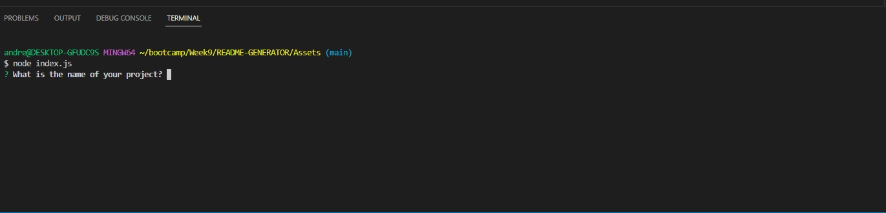

## README-GENERATOR
Hello and welcome to my README Generator program!

This program was written and created by me, Andrew Gracia. 

It is created to assist in the task of making a README for your future projects.

This is accomplished by running the program in your terminal of choice. You would need to use the "node" command and have it run the "index.js" file.

Once you run the index.js file in your terminal, it will ask you a series of questions. Fill them out to the best of your ability and the README file will generate automatically once it is complete! Please see the screenshot below to see what the start of the questions look like:

[Link to video showing application functionality](https://drive.google.com/file/d/1hCsWxO6snqQhb7LqHoZKj5bcU1HY5MXW/view)

This README Generator was created without any license and is free to use by anyone!

